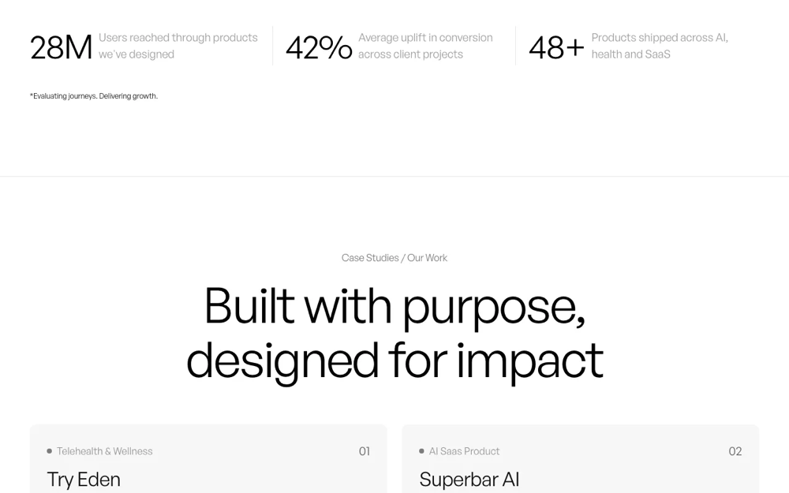
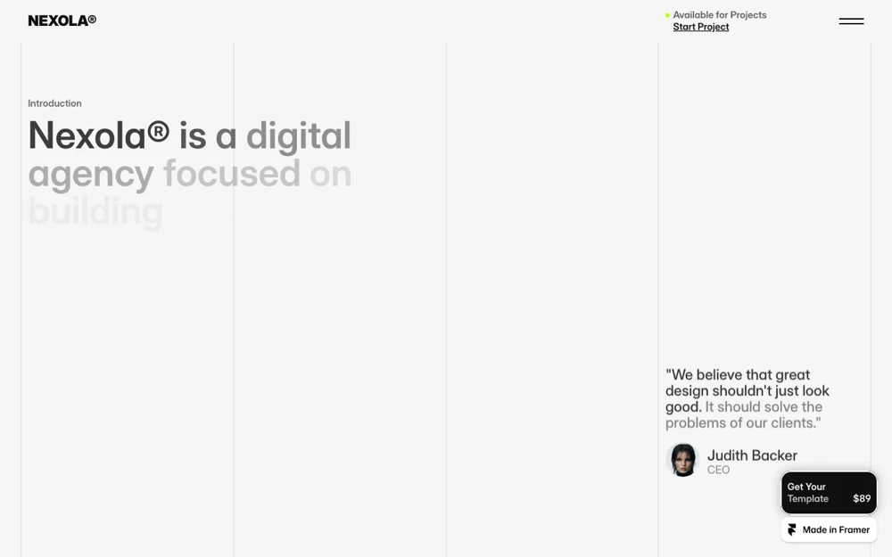
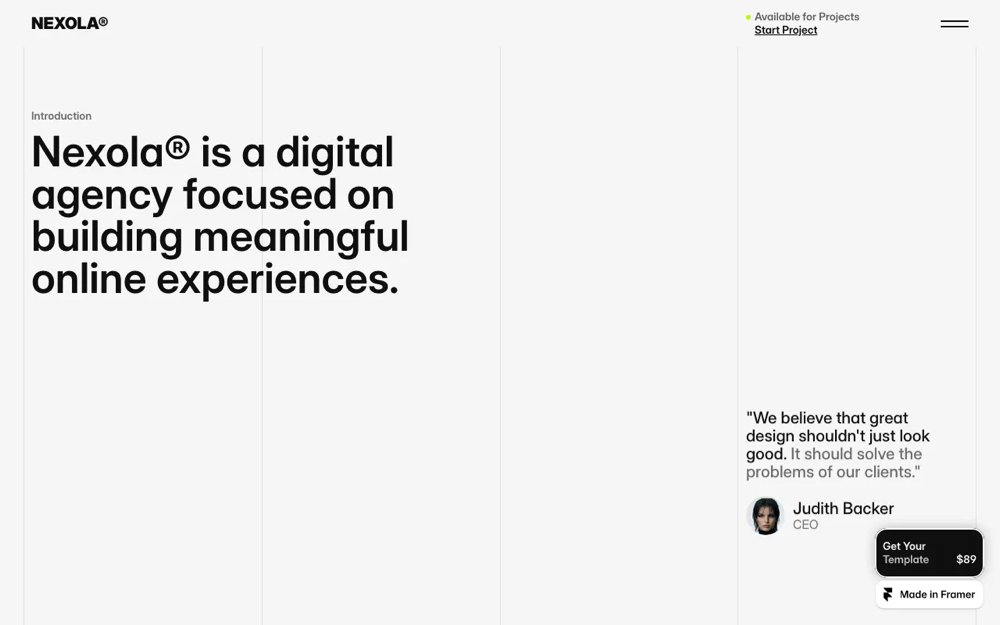

# Choosing a model for Snapp: a model evaluation case study

**Product:** [Snapp](https://www.usesnapp.app) — save websites you admire, tag what to borrow from each, and get one design guide your coding agent can build from.
**Question:** which LLM should generate the guides, and what does that decision cost?
**Period:** July–August 2026
**Outcome:** stayed on Claude Sonnet 5 — but the evaluation's real product was a **data-quality fix** that was worth more than the model choice, plus two production bugs the eval surfaced.

---

## 1. Why this wasn't a benchmark question

Snapp has two AI features. Both take real websites and produce a Markdown design system — colour tokens, type scale, spacing, components, and a paste-ready prompt for Cursor or Claude Code.

The trigger wasn't curiosity about models. It was unit economics. The existing Pro tier allowed 200 guides/month for $12, at roughly $0.10–0.15 per guide. Worst case that was **~$150 of cost against $12 of revenue.** The plan was underwater and the only levers were price, caps, or model.

That framing mattered. The question was never "which model scores highest." It was **"what is the cheapest model that doesn't damage the product, and what price does that let me charge?"**

---

## 2. The constraint that eliminated the obvious answer

The received wisdom was to use one of the cheap Chinese providers. DeepSeek V4-Flash is $0.14/$0.28 per million tokens against Sonnet's $3/$15 — a 20x difference on paper.

Both Snapp features are **vision-first**. The prompt states it explicitly: *the screenshot is the primary source of truth; extracted tokens are supporting evidence.* Every call sends 1–8 images.

That single requirement removed most of the candidate list:

| Provider | Price (in/out per MTok) | Vision |
|---|---|---|
| DeepSeek V4-Flash | $0.14 / $0.28 | ✗ text-only |
| Qwen3.6 Flash | $0.19 / $1.13 | ✗ text-only |
| GLM-4.6 | $0.43 / $1.74 | ✗ text-only |
| Kimi K2.6 | $0.95 / $4.00 | ✓ |
| Gemini 3 Flash | $0.50 / $3.00 | ✓ |
| Claude Haiku 4.5 | $1.00 / $5.00 | ✓ |
| Claude Sonnet 5 | $3.00 / $15.00 | ✓ |

**The famously cheap models are the text-only ones.** Filtered for vision, Kimi — the one people cite as the budget option — costs *more* than Gemini 3 Flash and about the same as Haiku. The 20x saving was never available for this workload.

*Takeaway: cost comparisons are meaningless until you've filtered by capability. The published headline price described a product I couldn't use.*

---

## 3. Reading the cost structure, not the sticker price

Measured against the real workload rather than assumed:

| | Input | Output |
|---|---|---|
| Single-site guide | 8% | **92%** |
| Mix (4 sources) | 20% | **80%** |

**Output tokens are almost the entire bill.** Three consequences:

1. Output price per token is effectively the whole decision. Input price and image-token differences are rounding errors.
2. **Shortening the output is a cost lever comparable to switching providers** — a strategy that doesn't exist if you only look at vendor pricing pages.
3. Prompt-caching work, which I'd assumed was significant, was worth very little here.

---

## 4. Building the evaluation — and three flaws I found in it

I built a blind A/B harness (`scripts/eval-guides.mjs`): same prompt, same real scans from the live library, multiple models, output written under opaque filenames with the answer key in a separate file.

No public benchmark tells you whether a *design guide* is good. The only meaningful test was the one in the product's own documentation: **paste the generated agent prompt into Claude Code and see whether the result resembles the source site.**

The harness needed three corrections before it measured anything:

**Flaw 1 — the comparison was confounded.** Sonnet's first run returned `7931, 8000, 8000, 8000, 8000, 7997` output tokens. Four of six hit the `max_tokens` ceiling exactly. I was comparing *truncated* Sonnet output against complete Gemini output. Raising the cap to 20,000 revealed Sonnet's natural length for this template: **7,761 / 7,990 / 8,463**. The 8,000 cap sat precisely on the model's output distribution.

This was a **live production bug**, not an eval artifact — roughly half of all user-facing guides were being cut off, usually severing the paste-ready prompt at the very end, which is the most valuable section. *The evaluation paid for itself here before producing a single comparison.*

**Flaw 2 — the "blind" test wasn't blind.** Generation ran scan-by-scan, so odd-numbered files were always model A and even-numbered always model B. Worse, the console printed timing and token counts as it went — `82s / 7931 tokens` versus `16s / 2965` identifies the model as surely as printing its name. Fixed by shuffling jobs before assigning labels and moving all per-generation stats into the key file.

**Flaw 3 — a wrong model ID cost a full run.** `gemini-3-flash` doesn't exist; the API name is `gemini-3-flash-preview`. Every Gemini call 404'd *after* the Anthropic calls had already been paid for. Added a pre-flight check that validates model IDs against the provider's live list before generating anything.

---

## 5. The pivotal finding: the metric disagreed with the product

With a clean comparison, two evaluation methods pointed in opposite directions.

**Automated compliance scoring** — counting how many of the template's 34 mandatory sections each model produced:

| | Sections present |
|---|---|
| Sonnet 5 | 33.8 / 34 (100%) |
| Gemini 3 Flash | 29.2 / 34 (86%) |
| Haiku 4.5 | 34 / 34 (100%) |

**LLM-as-judge** — an agent comparing the documents — preferred Haiku, praising its accessibility checklist, React snippets, and component depth.

**The rendered page test** — running each guide's agent prompt through Claude Design and comparing the actual landing pages — preferred **Sonnet**, twice.

Both automated methods rewarded *comprehensiveness*. The rendered output showed comprehensiveness could be actively harmful.

The mechanism, traced end to end: Haiku's guide specified an **"Accent Background Card"** — a component that doesn't exist on the source site, which uses its lime accent sparingly on buttons and small marks. The coding agent faithfully built it. It became the worst element on the resulting page.

*Takeaway: a design guide isn't a document to be read, it's a prompt for a coding agent. Its quality is the quality of what gets built from it. Section counts measure thoroughness, and thoroughness past the point of evidence degrades the output. **The LLM judge preferred the longer document both times the rendered page said otherwise.***

---

## 6. Root cause: it was a data problem wearing a model problem's costume

The decisive catch came from inspecting an individual claim rather than a score. Haiku's guide for `dstudio.agency` stated:

> **Sharp Corners by Default**: Border-radius is 0px for inputs, cards, and most components.

The scanner, once it was actually measuring, reported `8px`, `10px`, `9999px` and `24px` on that site — and **no 0px at all**.

Investigating that one error reframed the entire evaluation. Here is the whole cause, in two images.

| What the model received | What it never saw |
|---|---|
|  |  |
| One 1280×800 above-the-fold frame. No card, no input, no container — nothing rounded is visible. | The same page further down. Rounded cards everywhere, measured at 8px and 10px. |

The model wasn't wrong about the image it was given. It was asked to describe components that weren't in it.

The guide template demands five token categories: Colours, Typography, **Border Radius, Shadows, Spacing Scale**. The scraper extracted **two**. Three of the five were being *invented* by the model from a single above-the-fold screenshot — and on that particular site, no rounded component was visible in the one image it received.

**Every model tested made this class of error.** It was never a model-quality problem.

Two fixes, both upstream of the model:

- **Measure the tokens.** A DOM pass now reads `border-radius`, `box-shadow` and the spacing rhythm off the live page and presents them to the model as facts to copy, not hints. (Detail that mattered: `0px` radius is deliberately *not* counted — it's the CSS default, so every icon and wrapper div votes for it and buries the handful of real decisions.)
- **Capture the whole page.** Screenshots became three viewport-height bands instead of one above-the-fold shot. A single full-page capture would have been downsampled to unreadable by the model APIs.
- **Photograph a finished page, not a loading one.** Scroll-reveal animation is standard on the sites Snapp's users admire, and a fixed delay after scrolling catches it mid-flight:

| Captured mid-animation | After forcing animations to settle |
|---|---|
|  |  |
| *"Nexola® is a digital agency focused on building"* — the rest of the sentence is transparent. | The full sentence. Same page, same scroll position. |

  Two harms in one frame: the model can't read the copy, **and** those transient mid-fade greys land in the extracted palette as if they were brand colours. Waiting longer only moves the race — the fix was to emulate `prefers-reduced-motion`, then call `document.getAnimations()` and finish each one. (That API covers the Web Animations API, which is what Framer and GSAP actually drive reveals through — a CSS-only override would have missed exactly this case.)

Result on a re-test: every measured value landed in the correct slot, with shadows copied verbatim and correctly attributed. **And the model gap largely closed** — Haiku went from failing to 34/34 with correct values, because the job changed from *invent plausible tokens from a partial image* to *organise measured facts into a template*.

*Takeaway: when every candidate model fails the same way, stop evaluating models. Improving the input beat improving the model, and it made the model choice matter less — which is the durable outcome, because it compounds with future model improvements instead of fighting them.*

---

## 7. A negative result, and shipping it anyway

Hypothesis: if over-specification causes the coding agent to build things that shouldn't exist, a tighter template should produce better pages.

I built the tightened prompt as a reviewable patch over the original, ran both variants across two additional sites, and compared rendered pages.

**Structurally it worked** — invented component blocks fell from 8→5 and 8→3, with every omission verified against the scraper as genuinely absent, and output dropped ~7.5%.

**The page quality difference was undetectable.** And measuring *why* produced the more useful finding: two runs of the *same* condition differed more from each other (18,883 bytes / 6 sections vs 30,972 / 8 sections) than the two conditions differed from each other. **The downstream agent's run-to-run variance exceeded the effect size I was trying to measure.** A single A/B per site couldn't resolve it, and the sample count needed would have cost more than the answer was worth.

The theory was wrong. The change shipped anyway — for the two benefits that *were* measured: ~7.5% lower output cost, and guides that stop describing checkboxes on sites that have no forms. Both hold regardless of the downstream agent.

*Takeaway: knowing your noise floor tells you when to stop measuring. And a failed hypothesis doesn't invalidate a change that has independent, measured justification — those are two separate questions, and conflating them nearly threw away a good change.*

---

## 8. The decision, and what it did to pricing

**Stayed on Claude Sonnet 5.** With the input fixed, the cheap models became viable — but the rendered-page test still favoured Sonnet, and the product's positioning is quality-first.

That decision has a price, and the pricing was rebuilt around it rather than the reverse:

| | Cost per guide | Worst-case margin, Pro @ $9.99 |
|---|---|---|
| Sonnet 5 | $0.139 | 21% (73% typical) |
| Haiku 4.5 | $0.042 | — |
| Gemini 3 Flash | $0.012 | — |

Final structure: **Free (1 credit) / Lite $3.99 (10) / Pro $9.99 (40)**, monthly or quarterly, with single-site guides and Mixes drawing on one shared credit pool — safe because measurement showed the cost spread between them is only 1.25x.

The `resolveModel(feature, plan)` abstraction stayed in the codebase, so switching a tier or a feature to a cheaper model is a one-line change when the evidence justifies it.

---

## 9. What the evaluation actually produced

Ranked by value, which is not the order I expected:

1. **A data-quality fix** that improved output for every model — three of five token categories went from invented to measured.
2. **A production truncation bug**, caught incidentally — ~50% of guides were being cut off mid-sentence, losing the most useful section.
3. **A second truncation bug** in the Mix route, found only because I checked whether the first fix had covered both call sites. It hadn't.
4. **A cost model grounded in measurement** — which directly set the price points.
5. **The model decision itself** — arguably the least valuable output.

---

## 10. Transferable principles

**Filter by capability before comparing cost.** The cheapest option on the pricing page couldn't do the job at all.

**Find where the money actually goes.** Output was 80–95% of spend, which made output length a lever equal in size to the provider choice.

**Evaluate the artifact the user consumes.** Documents were scored by two automated methods that both got it wrong. The rendered page was the only metric that tracked reality.

**Distrust LLM-as-judge for holistic quality.** It preferred the more comprehensive document both times, and both times the built page disagreed. It's useful for verifiable properties (is section X present?), not for "which is better."

**When every model fails identically, the problem is upstream.** Improving inputs beats improving models, and it makes model choice less consequential — which compounds with future progress rather than fighting it.

**Measure your noise floor before trusting an A/B.** Run-to-run variance in the downstream system exceeded the effect I was chasing.

**Separate "my hypothesis was wrong" from "this change is worthless."** They're different questions with different evidence.

---

## Appendix — artifacts

| | |
|---|---|
| Eval harness | `scripts/eval-guides.mjs` — blind A/B, shuffled labels, multi-provider, truncation detection |
| Scan inspector | `scripts/scan-preview.mjs` — runs the real scraper on any URL and optionally generates a guide, no database round-trip |
| Model registry | `src/lib/ai/models.ts` — `resolveModel(feature, plan)` |
| Token extraction | `src/lib/scraper/page-analyzer.ts` — `extractStyleTokensFromPage` |
| Technique log | `docs/AI-FEATURES.md` — every technique with its reasoning, including rejected ideas and honest caveats on the negative result |

**Still open:** the Mix feature was never separately evaluated — it's the harder synthesis task and a model that wins on single-site guides won't necessarily win there. Cross-provider comparison also stopped once the input fix closed most of the gap; Gemini 3 Flash on the free tier remains the strongest untested cost lever.
